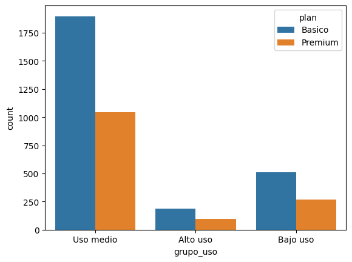
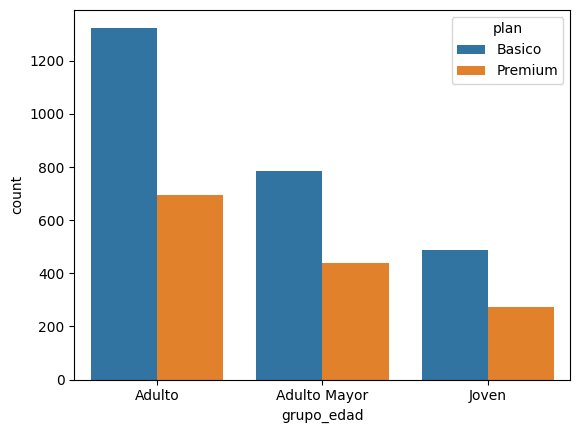
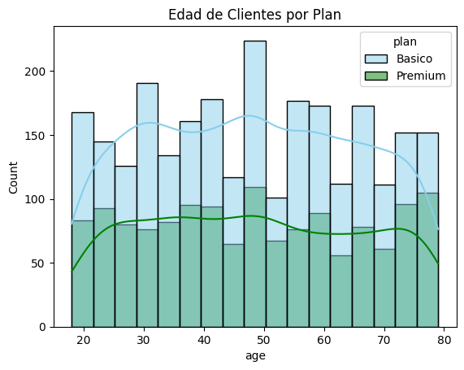

# ConnectaTel — Customer Segmentation & Retention Analytics


## Contexto

ConnectaTel es una empresa de telecomunicaciones en América Latina
con dos planes: Básico ($12 USD/mes) y Premium ($25 USD/mes).
El equipo directivo necesita entender cómo usan realmente los servicios
sus clientes, qué segmentos existen y qué estrategias de retención
son viables basadas en datos reales.

## Pregunta de Negocio

¿Cómo se comportan los clientes según su plan, edad y nivel de uso?
¿Qué segmentos son más valiosos y qué acciones pueden mejorar
la retención e ingresos de ConnectaTel?

## Datasets Utilizados

| Archivo | Descripción | Registros |
|---|---|---|
| `plans.csv` | 2 planes: precio, minutos, GB, costo por excedente | 2 filas |
| `users_latam.csv` | Clientes: edad, ciudad, fecha registro, plan, churn | 4,000 filas |
| `usage.csv` | Uso real por cliente: llamadas y mensajes | 40,000 filas |

**Planes disponibles:**

| Plan | Precio | Minutos | Mensajes | GB | Costo extra/min |
|---|---|---|---|---|---|
| Básico | $12 USD/mes | 100 | 100 | 5 GB | $0.10 |
| Premium | $25 USD/mes | 600 | 500 | 20 GB | $0.07 |

## Proceso de Limpieza

**Problemas encontrados y decisiones tomadas:**

| Problema | Columna | Magnitud | Acción |
|---|---|---|---|
| Sentinel `-999` | `age` | Presente en dataset | Reemplazado con mediana (47 años) |
| Sentinel `?` | `city` | 469 registros (11.7%) | Reemplazado con NaN |
| Fechas futuras imposibles | `reg_date` | 40 registros (año 2026) | Convertidos a NaT |
| Nulos estructurales MAR | `usage.duration` | 22,076 (55.2%) | Mantenidos — ausentes solo en registros tipo 'text' |
| Nulos estructurales MAR | `usage.length` | 17,896 (44.7%) | Mantenidos — ausentes solo en registros tipo 'call' |
| Clientes activos sin churn | `churn_date` | 3,534 (88.35%) | Mantenidos — representan base activa |

**Verificación MAR confirmada:** `duration` es nula únicamente en
registros tipo 'text' (22,076 casos). `length` es nula únicamente
en registros tipo 'call' (17,896 casos). Ausencias estructurales
del negocio, no errores de captura.

## Estadísticas de Uso por Usuario

| Métrica | Mensajes | Llamadas | Minutos |
|---|---|---|---|
| Promedio | 5.52 | 4.48 | 23.31 min |
| Mediana | 5 | 4 | 19.78 min |
| Máximo | 17 | 15 | 155.69 min |
| Límite IQR (outliers) | 11.5 | 10.5 | 61.87 min |

## Hallazgos Principales

**Distribución por plan:**
- Plan Básico: **64.9%** de usuarios (2,595)
- Plan Premium: **35.1%** de usuarios (1,405)

**Distribuciones por variable:**
- Edad: **simétrica** — base madura y homogénea (media: 48 años, rango: 18-79)
- Mensajes: **sesgada a la derecha** — Premium concentra los envíos más largos
- Llamadas: **simétrica** — comportamiento uniforme en ambos planes (5-8 llamadas)
- Minutos: **sesgada a la derecha** — Premium acumula picos superiores a 1,000 min

**Outliers detectados (método IQR):**
- `cant_mensajes` > 11.5: power users reales → **mantenidos**
- `cant_llamadas` > 10.5: clientes comerciales de alto volumen → **mantenidos**
- `cant_minutos_llamada` > 61.87 min (máx: 155.69): picos genuinos de demanda → **mantenidos**

**Segmentación por edad:**
- Joven (<30 años): base en crecimiento, adopción Premium más rápida
- Adulto (30-60 años): motor principal del negocio, lealtad estable
- Adulto Mayor (>60 años): uso conservador y constante

**Segmentación por nivel de uso:**
- Bajo uso (llamadas <5 y mensajes <5)
- Uso medio (llamadas <10 y mensajes <10)
- Alto uso (resto) — incluye power users actualmente en plan Básico

**Hallazgo crítico:**
Clientes de Alto uso en plan Básico pagando excedentes variables en lugar
de migrar al Premium. El plan Básico cubre 100 minutos pero la mediana
de consumo es 19.78 minutos — sin embargo los outliers superan 155 min,
pagando excedentes a $0.10/min vs $0.07/min en Premium.

## Visualizaciones





## Recomendaciones Estratégicas

1. **Migración predictiva:** Identificar usuarios de Alto uso en plan
   Básico y contactarlos con oferta de upgrade a Premium con descuento
   por lealtad. Convierte excedentes variables ($0.10/min) en ingreso
   recurrente predecible ($25 USD/mes).

2. **Plan intermedio:** Con 64.9% en Básico y solo 35.1% en Premium,
   existe una brecha que un plan de $18-20 USD podría capturar —
   especialmente para el segmento de Uso Medio que supera el Básico
   pero no justifica el Premium completo.

3. **Retención Adulto Mayor:** Perfil de uso conservador pero constante.
   Plan especializado con soporte prioritario y beneficios en llamadas
   internacionales reduce churn en el segmento más estable.

## Cómo Ejecutar el Notebook

1. Clona el repositorio
2. Instala dependencias:
```bash
pip install pandas numpy matplotlib seaborn
```
3. Coloca los archivos CSV en una carpeta `/datasets/` en la misma ruta
4. Abre el notebook en Jupyter o en
   [Google Colab](https://colab.research.google.com/)
5. Ejecuta las celdas en orden secuencial (Runtime → Run all)

## Estructura del Repositorio
```
📦 Proyecto-6-ConnectaTel-Retention-Analytics
 ┣ 📂 img
 ┃ ┣ 🖼️ segmentacion_uso.png       → Countplot grupo_uso por plan
 ┃ ┣ 🖼️ segmentacion_edad.png      → Countplot grupo_edad por plan
 ┃ ┗ 🖼️ distribucion_edad.png      → Histograma edad por plan
 ┣ 📓 S7_Version-Estudiante-Project-ConnectaTel_corregido.ipynb
 ┗ 📋 README.md                    → Este archivo
```
## Autor

David Germán Ramos Rodríguez
[LinkedIn](https://www.linkedin.com/in/david-g-ramos/) |
[Portfolio](https://dataanalist-davidgramos.github.io/mi-sitio-web/)
